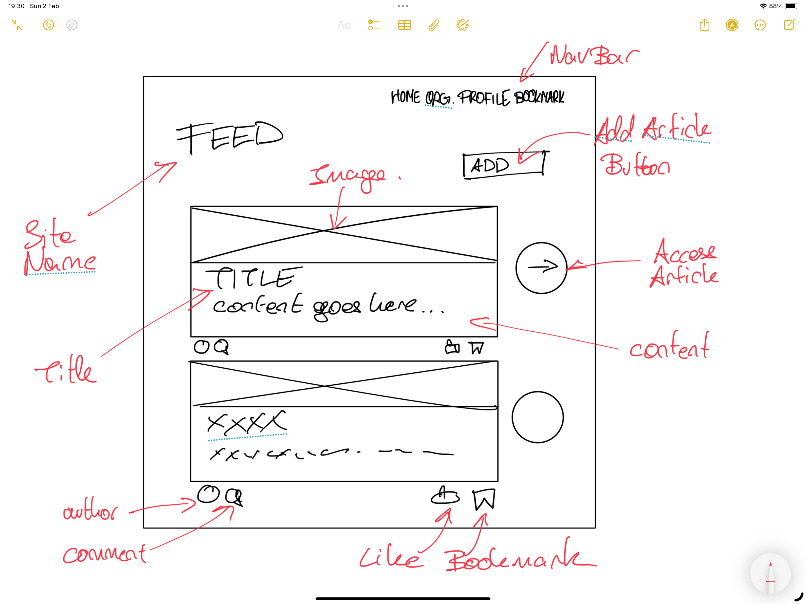
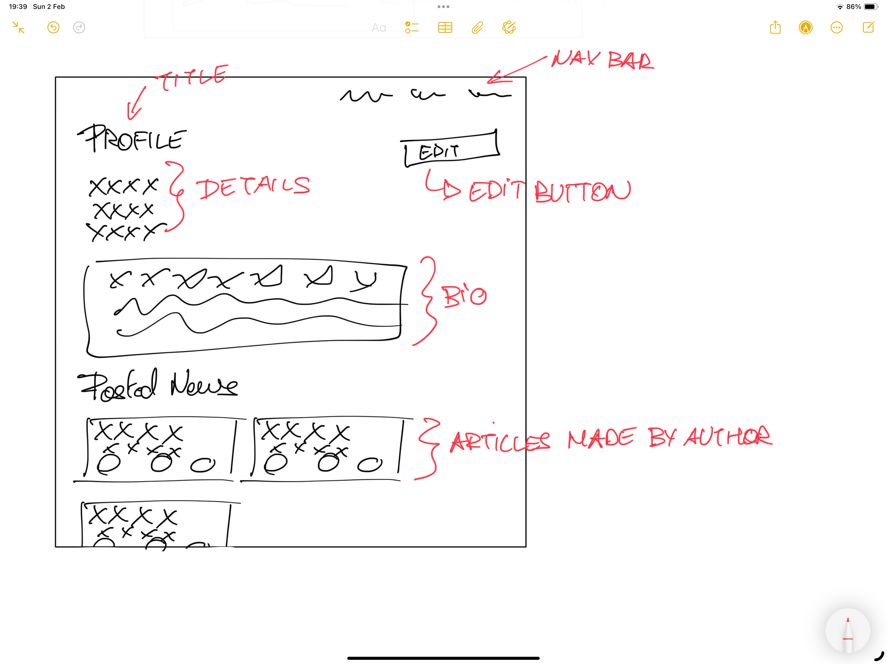
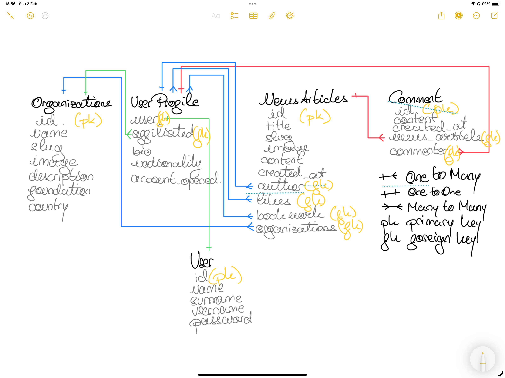

# updated_news

## Description
`updated_news` is a Django-based platform for publishing and interacting with news articles.
Users can view, like, bookmark, comment on, and share articles. The platform also allows for
creating and managing organizations and user profiles, where authors can write, edit, or delete articles. 

The platform offers a clean, user-friendly interface for both general users who wish to stay
updated with the latest news and authenticated users who can engage with articles through comments,
likes, and bookmarks. Additionally, the organization feature helps to associate news articles with
specific entities.

---

## UX (User Experience)

### Ideal Client
- **Business**: This platform is ideal for news organizations, content creators, and companies looking to engage their audience with real-time news, user interactions, and personalized content feeds.
  
- **Visitors to the Website**: The target audience includes individuals who want to stay updated with news in specific fields, ranging from technology and politics to sports and entertainment. Visitors can browse through a list of articles or narrow down results by category or organization.

- **Client Stories**: A typical user could be someone looking for the latest tech news and filtering through articles from affiliated organizations. An authenticated user could engage by liking articles, leaving comments, or bookmarking them for later reading.

# User Stories and Acceptance Criteria

### 1. **As a new user, I want to create a profile, so I can have my personal information stored and interact with the system.**
   **Acceptance Criteria:**
   - User can create a profile with details like bio, nationality, and affiliation with an organization.
   - Users are linked to their profile through the `UserProfile` model.
     #### Criteria met with:
     - **Feature**: Add User Profile
     - **Feature**: Profile Modifications
     - **Feature**: User Profile Integration in News Articles and Comments

### 2. **As an authenticated user, I want to see news articles that I can like, comment on, and bookmark, so I can interact with the content.**
   **Acceptance Criteria:**
   - User can view news articles, like them, comment on them, and bookmark them.
   - Articles display the number of likes, comments, and bookmarks.
   - A user can interact with articles without creating them.
     #### Criteria met with:
     - **Feature**: View All News Articles
     - **Feature**: Like Articles
     - **Feature**: Bookmark Articles
     - **Feature**: Add Comment
     - **Feature**: View Comments and Interact

### 3. **As a user, I want to belong to an organization, so I can see articles related to that organization and have my affiliation visible.**
   **Acceptance Criteria:**
   - Users can be affiliated with an organization, and this affiliation is stored in their profile.
   - Articles can be associated with an organization, and users can filter content based on their organization.
     #### Criteria met with:
     - **Feature**: Organizations
     - **Feature**: User Affiliation with Organizations
     - **Feature**: Organization News Articles

### 4. **As an organization admin, I want to view the total number of authors (users) affiliated with my organization, so I can see how many users are engaged.**
   **Acceptance Criteria:**
   - Admin can view the total number of affiliated users.
   - This information is dynamically updated as users are affiliated with the organization.
     #### Criteria met with:
     - **Feature**: Total Authors in Organization (total_authors method in the Organizations model)

### 5. **As a user, I want to view comments on news articles, so I can see what others are saying about the content.**
   **Acceptance Criteria:**
   - Users can view comments on news articles.
   - Each comment shows the commenter's information and the time it was posted.
     #### Criteria met with:
     - **Feature**: View Comments on News Articles
     - **Feature**: Display Commenter Information (e.g., username, timestamp)

### 6. **As a user, I want to search for news articles by title or content, so I can find relevant information.**
   **Acceptance Criteria:**
   - Users can search for articles by title or content.
   - Search results show matching articles.
     #### Criteria met with:
     - **Feature**: Search Functionality for News Articles (implied, could be added with a search bar feature)

### 7. **As a user, I want to see an image with each news article, so I can better understand the content before reading.**
   **Acceptance Criteria:**
   - Each news article displays an image (if provided).
   - The image is optional, and articles without an image are still viewable.
     #### Criteria met with:
     - **Feature**: Image Upload for News Articles

### 8. **As a user, I want to like a news article, so I can show my support for the content.**
   **Acceptance Criteria:**
   - Users can like an article, and their like is registered.
   - The total number of likes for each article is displayed.
     #### Criteria met with:
     - **Feature**: Like Articles
     - **Feature**: Display Total Likes

### 9. **As a user, I want to save articles for later, so I can come back to them when needed.**
   **Acceptance Criteria:**
   - Users can bookmark articles, saving them for future reference.
   - The number of users who have bookmarked an article is displayed.
     #### Criteria met with:
     - **Feature**: Bookmark Articles
     - **Feature**: Display Total Bookmarks

## 5 Planes of UX Design (as this is a fictious project the steps below go beyond what is achievable as a educational project):

### 1. **Strategy Plane**
   The strategy plane focuses on understanding the needs of users interacting with news articles, managing profiles, and affiliating with organizations.

   **Key Concepts:**
   - **User Research**: Understand who the target users are (e.g., journalists, readers, organization admins) and their needs (e.g., liking articles, managing profiles).
   - **Business Goals**: Align the platform features with business goals like user engagement and content creation.
   - **Content Strategy**: Define how content like news articles, user profiles, and organization-related information will be presented.

   **Tasks to Complete:**
   - Conduct user interviews to understand user preferences for interacting with articles and profiles.
   - Create user personas (e.g., article authors, readers, organization admins).
   - Establish project goals such as increasing article interactions and supporting user engagement.

---

### 2. **Scope Plane**
   The scope plane defines the core features and functionalities that users need for interacting with content.

   **Key Concepts:**
   - **Functional Requirements**: Include features such as liking, commenting, bookmarking, article creation, and profile management.
   - **Feature Set**: Users should be able to like, comment, and bookmark articles, and create/edit their own articles.
   - **User Stories**: Write user stories to reflect the needs of users. For example: "As a user, I want to like an article" or "As an admin, I want to track affiliated users."

   **Tasks to Complete:**
   - Write user stories like "As a user, I want to like an article."
   - Prioritize features related to article interactions, creation, and profile management.
   - Define how users will interact with the system (e.g., liking, bookmarking, commenting).

---

### 3. **Structure Plane**
   The structure plane defines how content will be organized to make it accessible and easy to navigate for users.

   **Key Concepts:**
   - **Information Architecture (IA)**: Organize the content and navigation to ensure users can easily access articles, profiles, and organizations.
   - **Navigation Design**: Develop navigation flows to allow users to explore articles, access their profiles, and filter content by organizations.
   - **Interaction Design**: Plan how users will interact with elements such as the "like," "comment," "bookmark," and "edit" buttons.

   **Tasks to Complete:**
   - Develop an IA diagram for articles, comments, and profiles.
   - Create wireframes for article listing, profile, and organization pages.
   - Define interaction flows for liking, bookmarking, and commenting on articles.

---

### 4. **Skeleton Plane**
   The skeleton plane focuses on layout and visual hierarchy of elements to ensure a smooth and intuitive user experience.

   **Key Concepts:**
   - **Wireframes**: Design wireframes that show the layout for pages with articles, comments, and profile details.
   - **UI Elements**: Define the look of UI components like buttons for liking, commenting, and bookmarking.
   - **Grid Systems**: Use consistent grid layouts to maintain alignment across pages.
   - **Visual Hierarchy**: Ensure that important elements, like article titles and buttons, stand out visually.

   **Tasks to Complete:**
   - Design wireframes for article pages, profile pages, and organization pages.
   - Define and implement a grid system for page layout consistency.
   - Ensure visual hierarchy prioritizes key elements (e.g., article titles, like buttons).

---

### 5. **Surface Plane**
   The surface plane involves finalizing the visual design elements, including colors, typography, and branding.

   **Key Concepts:**
   - **Visual Design**: Apply the brand’s color scheme, fonts, and images to wireframes for a visually engaging experience.
   - **Brand Consistency**: Ensure the platform’s design aligns with the brand’s tone (e.g., professional for organizations, engaging for readers).
   - **User Feedback**: Implement visual feedback for interactions (e.g., a change in color when liking an article).
   - **Responsiveness**: Design for mobile, tablet, and desktop responsiveness to ensure accessibility on all devices.

   **Tasks to Complete:**
   - Create high-fidelity mockups for article, profile, and organization pages.
   - Apply brand colors, fonts, and other design elements.
   - Implement responsive design to ensure usability across all devices.
   - Design interactive states like hover effects on buttons and visual changes when liking or bookmarking articles.

### Wireframes
1. **Homepage Wireframe**:
   - Navigation bar with sections like Home, News Feed, Organizations, and Profile.
   - A list of all news articles with brief previews and links to full articles.
   - Option to filter by organization or news category.
   
2. **News Article Page**:
   - Article title, content, and images.
   - Like, bookmark, and comment sections.
   - Author information and related articles at the bottom.

3. **User Profile Page**:
   - User details such as bio and nationality.
   - A list of articles authored by the user.
   - Ability to edit the profile.

4. **Organization Page**:
   - Organization name, description, and affiliated articles.
   - Option to filter articles by organization.
     

---

## Features

### Existing Features
# Feature List

## 1. User Authentication & Profile Management
1. **Login and Registration**
   - (Assumed, not shown in views but necessary for full functionality).

2. **User Profile**
   - View user's profile with personal information and all their authored news articles.
   - Modify user's profile details such as bio, nationality, etc.
   - Only the user can modify their own profile.

## 2. News Articles
1. **View All News Articles**
   - Display a list of all available news articles.
   - Each article is shown with its title and basic details (potentially a brief content preview or image).

2. **View Selected News Article**
   - View the full details of a selected news article.
   - View comments and interact with them (add comments).
   - Each article has associated comments from users, and users can add new comments.

3. **Like Articles**
   - Users can "like" or "unlike" articles.
   - Track how many likes an article has.

4. **Bookmark Articles**
   - Users can "bookmark" articles to save them for later reference.
   - Track articles that the user has bookmarked.

5. **Add News Article**
   - Authenticated users can add new news articles.
   - Include form validation for adding the article title, content, images, etc.
   - Optionally, assign the article to an organization if the user is affiliated.

6. **Edit News Article**
   - Allow the author to edit their news article (e.g., update title, content, etc.).
   - Ensure that only the author can edit their own articles.

7. **Delete News Article**
   - Allow the author to delete their news article.
   - Ensure that only the author can delete their own articles.

## 3. Comments
1. **Add Comment**
   - Authenticated users can add comments to news articles.
   - Display success message upon comment submission.

## 4. Organizations
1. **View All Organizations**
   - Search for organizations by name (optional).
   - Display a list of all organizations.

2. **View Selected Organization**
   - View an organization's detailed page, including its associated news articles.

3. **Add Organization**
   - Authenticated users can add new organizations.
   - The organization can have a name, description, logo, and country.

4. **Organization News Articles**
   - View all news articles affiliated with a specific organization.
   - Allows the association of news articles with organizations.

## 5. Feature Management for Authenticated Users
1. **News Article Interactions**
   - Like and bookmark articles.
   - Un-like and remove bookmarks from articles.

2. **Profile Modifications**
   - Update user's profile information (bio, nationality, etc.).
   - Ensure that only the user can modify their own profile.

## 6. UI/UX
1. **Messages**
   - Show success messages when a user interacts with the site (e.g., successfully liked a post, added a comment, etc.).

2. **Redirect on Actions**
   - After liking, bookmarking, or submitting a comment, redirect users back to the relevant page (e.g., back to the article detail page).

## 7 .Data Filtering and Sorting
1. **Search and Filter**
   - Search for organizations by name.
   - Possibly filter or sort articles or organizations by date, relevance, or popularity.

## 8. Authorization and Access Control
1. **Authorization Enforcement**
   - Ensure that only authenticated users can add articles, bookmark, like, and comment.
   - Only allow users to edit or delete their own articles.

2. **Access Control**
   - Prevent unauthorized users from viewing/editing other users' data.

## 9. Miscellaneous
1. **Slug Handling**
   - Automatically generate slugs for articles and organizations based on their names.

2. **Image Uploads**
   - Support image uploads for organizations and news articles.
  
### Future Features
- **User Authentication & Authorization**: A more robust system for managing different user roles (e.g., readers, authors, admins).
- **Notification System**: Users can receive notifications for new articles or replies to their comments.
- **Search Functionality**: Allow users to search for articles by keywords, categories, or organizations.
- **Admin Panel**: A user-friendly admin panel to manage content, users, and organizations more effectively.

## Models

### Organizations
- **Fields:**
  - `name`: Name of the organization.
  - `slug`: Slug for URL.
  - `image`: Organization's image.
  - `description`: Description of the organization.
  - `foundation`: Date of foundation.
  - `country`: Country where the organization is located.

- **Methods:**
  - `total_authors()`: Returns the total number of users affiliated with the organization.

### UserProfile
- **Fields:**
  - `user`: A one-to-one relationship with the Django User model.
  - `affiliated`: Foreign key to the Organizations model, representing the user's affiliation.
  - `bio`: Short biography of the user.
  - `nationality`: Country field for the user's nationality.
  - `account_opened`: The date and time the user account was created.

- **Methods:**
  - None directly defined in the model.

### NewsArticles
- **Fields:**
  - `title`: Title of the article.
  - `slug`: Slug for the article URL.
  - `image`: Optional image associated with the article.
  - `content`: Body content of the article.
  - `created_at`: Date and time when the article was created.
  - `author`: Foreign key to the UserProfile (author).
  - `organization`: Foreign key to the organization related to the article.
  - `likes`: Many-to-many relationship with UserProfile (liked users).
  - `bookmark`: Many-to-many relationship with UserProfile (bookmarked users).

- **Methods:**
  - `total_likes()`: Returns the total number of likes.
  - `total_comments()`: Returns the total number of comments.

### Comment
- **Fields:**
  - `content`: Content of the comment.
  - `created_at`: Timestamp when the comment was created.
  - `news_article`: Foreign key to the related article.
  - `commenter`: Foreign key to the UserProfile of the commenter.
---

## Technologies Used
- **Frontend**: 
  - HTML5, CSS3, JavaScript, FontAwesome
  - Bootstrap for responsive layout
  - AutoPrefixer for deployment on different browsers
  
- **Backend**: 
  - Django for handling backend logic and database models
  - SQLite (development) / PostgreSQL (production) for database management
  
- **APIs**: 
  - Django built-in authentication for user management.
  
- **Deployment**:
  - GitHub for version control
  - Heroku for cloud deployment
  
- **Testing**:
  - Pytest for backend tests (unit tests and integration tests).
  - Jest and Selenium for frontend and end-to-end testing.

---

## Testing Overview

This section provides an overview of the testing suite in this project, which is divided into multiple categories to ensure the functionality, correctness, and integrity of different aspects of the application. The tests include form validation, model behavior, URL resolution, and view functionality.

### 1. Form Tests

The form tests verify that the forms in the application handle both valid and invalid data correctly. These tests cover the core forms used in the project: `CommentForm`, `UserProfileForm`, `AddArticleForm`, and `OrganizationsForm`.

#### CommentFormTest
- **Valid Form Test**: Ensures that the `CommentForm` correctly handles a valid comment (e.g., a non-empty content field).
- **Invalid Form Test**: Verifies that the `CommentForm` does not validate when the content field is empty.

#### UserProfileFormTest
- **Valid Form Test**: Verifies that the `UserProfileForm` successfully validates when required fields (like nationality and bio) are filled correctly.
- **Invalid Form Test**: Ensures that the `UserProfileForm` is invalid if required fields are left blank or incorrectly filled.

#### AddArticleFormTest
- **Valid Form Test**: Confirms that the `AddArticleForm` passes validation when a title and content are provided, and an optional image is included.
- **Invalid Form Test**: Verifies that the `AddArticleForm` fails validation when the title or content fields are empty.

#### OrganizationsFormTest
- **Valid Form Test**: Ensures that the `OrganizationsForm` validates correctly when an organization name, description, and country are provided.
- **Invalid Form Test**: Verifies that the `OrganizationsForm` is invalid when required fields like name or description are left blank.

### 2. Model Tests

The model tests verify the integrity and behavior of the models in the application. These tests include checking string representations, ensuring related data is handled correctly, and testing model methods like `total_likes()` and `total_comments()`.

#### ModelsTest
- **Organization Model**: Tests the string representation of the `Organization` model to ensure it returns the correct name.
- **UserProfile Model**: Verifies that the `UserProfile` model’s string representation matches the associated user’s username.
- **NewsArticle Model**: Ensures the `NewsArticle` model’s string representation returns the article title.
- **Comment Model**: Checks that the `Comment` model returns the correct string representation, including the comment content and the author’s username.
- **Likes and Comments**: Verifies the correctness of the `total_likes()` and `total_comments()` methods, ensuring they accurately reflect the number of likes and comments for a news article.

### 3. URL Resolution Tests

The URL resolution tests ensure that each URL in the application is mapped to the correct view. These tests verify that all the necessary views resolve correctly for major URLs, such as article views, profile pages, and organization pages.

#### TestUrls
- **URL Resolution**: For each major URL, the test confirms that it resolves to the correct view function. For example, the `news_list` URL should resolve to the `all_news_articles` view, and the `add_article` URL should resolve to the `add_article` view.

### 4. View Tests

The view tests ensure that the views in the application work as expected when they are accessed through HTTP requests. These tests verify that views return the correct status codes, use the correct templates, and handle user actions like creating articles, liking, and bookmarking.

#### NewsViewsTest
- **All News Articles View**: Verifies that the `news_list` view renders successfully and uses the `news_list.html` template.
- **Selected News Article View**: Ensures that the `news_detail` view renders correctly and uses the `news_detail.html` template.
- **Add Article View**: Tests that a logged-in user can successfully submit a new article using the `add_article` view, and that the form redirects on success.
- **Like and Bookmark Views**: Verifies that the `like` and `bookmark` views work as expected, allowing users to like or bookmark news articles.
- **Profile View**: Ensures that the `profile_view` renders the correct user profile page.
- **Organizations View**: Confirms that the `organizations_list` and `organization_detail` views work and render the appropriate templates.

### Running Tests

To run the tests, use the following command in the terminal:
'python manage.py test'

## Deployment

First, update the requirements.txt file to include all necessary project dependencies. Follow these steps:

Open a terminal and run: pip3 freeze > requirements.txt
Commit the updated requirements.txt file to your GitHub repository and push the changes.
Log in to Heroku, or create a new account if you don’t have one already.

In the Heroku dashboard, click on Create New App. For new users, you’ll see a button right on the screen; for
existing users, you can find the option under the New dropdown at the top-right corner.

On the Create New App page, choose a unique name for your application, select the region, and click Create app.

Once your app is created, you’ll land on the app’s configuration page. You’ll need to configure settings on the 
Settings and Deploy tabs.

Setting Environment Variables:

Go to the Settings tab, scroll down to the Config Vars section, and click Reveal Config Vars.
In the key field, enter 'CREDS', and in the value field, paste the content of your creds.json file (which contains
your credentials for accessing the Google API). Then, click Add. Instructions for generating the creds.json file 
are available in the Google API and Spreadsheet Setup section above.

Configuring Buildpacks:

Still in the Settings tab, scroll down to the Buildpacks section.
Click Add buildpack, select Python, and save the changes.
Add another buildpack, select Node.js, and save the changes again. Make sure Python is listed first, followed 
by Node.js.

Linking with GitHub for Deployment:

Go to the Deploy tab in your app’s configuration page.
Under Deployment Method, select GitHub. If prompted, confirm the connection to your GitHub account.
Search for your GitHub repository and click Connect to 
link your Heroku app with your repository. Choose whether to enable Automatic Deploys, which will deploy the app 
whenever you push changes to the repository, or deploy manually by clicking Deploy Branch.

Running the App:

After the deployment completes, you can run the app by clicking the Open App button on the Heroku dashboard.

## Acknowledgments
Thank you to my mentor Brian Maccharia, who gave me valuable insights and discussions. 
